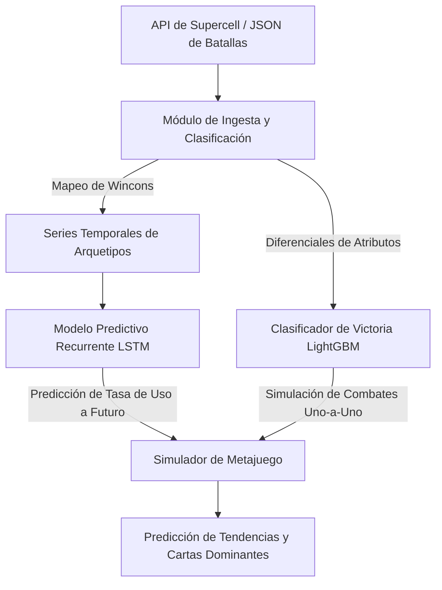

# Capítulo 7: Modelo Final, Justificación Científica y Arquitectura

En este capítulo se selecciona y justifica el mejor sistema predictivo para el metajuego de Clash Royale, describiendo su arquitectura técnica adaptada a entornos de recursos limitados.

## 1. Selección y Justificación Científica del Modelo Final

En base a la evidencia experimental recolectada, se determina que el mejor sistema predictivo es un **Ensamble Híbrido Secuencial (LSTM + LightGBM)**:

### Justificación de la Red LSTM
1. **Memoria de Largo Plazo:** La red LSTM demostró el menor error global de predicción (MAE: 0.006103) debido a su capacidad para retener dinámicas acumulativas temporales. Esto resulta crítico para modelar el comportamiento de los jugadores, quienes no cambian instantáneamente de mazo el día de un parche, sino que transicionan de forma progresiva a lo largo de las semanas.
2. **Conservación de Suma Cero:** Mediante una capa densa final acoplada a una función de activación Softmax o normalización posterior, la red LSTM puede imponer la restricción física de que la suma de las tasas de uso de todos los arquetipos siempre sea igual a 1.0 (100% del meta).

### Justificación de LightGBM (como Clasificador de Combates Complementario)
Para mapear las predicciones agregadas de arquetipos hacia cartas dominantes y simulación de combates individuales, se acopla un clasificador LightGBM.
1. **Eficiencia en CPU:** LightGBM requiere una fracción del costo computacional de XGBoost y entrena en milisegundos en 8GB de RAM.
2. **Interpretabilidad de Atributos:** Permite descomponer la influencia de los niveles de cartas, las copas iniciales y la sinergia estructural del mazo.

---

## 2. Arquitectura Completa del Sistema Predictivo

El flujo de procesamiento del sistema de IA se estructura en cuatro módulos acoplados:

### Módulos del Sistema:
1. **Módulo de Ingesta y Clasificación:** Consume los registros JSON crudos de batallas de la API oficial. Extrae las variables temporales, numéricas y categóricas. Utiliza diccionarios indexados en memoria RAM para asociar las IDs de cartas con condiciones de victoria en tiempo constante $O(1)$.
2. **Módulo de Series Temporales (LSTM):** Recibe las series temporales de uso y efectividad agregadas en ventanas de 1,000 batallas. Utiliza la red LSTM entrenada para proyectar las tasas de uso futuras ante la inercia de la temporada actual.
3. **Módulo Clasificador (LightGBM):** Modela la probabilidad de victoria de cualquier enfrentamiento de mazos en base a diferencias relativas de nivel, copas, costo de elíxir y sinergias identificadas (como el combo *Baby Dragon + Hunter*).
4. **Simulador de Metajuego (Monte Carlo):** Cruza las predicciones de popularidad de la LSTM con las probabilidades de victoria del LightGBM para identificar qué mazos sufrirán un colapso en su win rate tras un parche de balance y qué cartas emergerán como dominantes.
